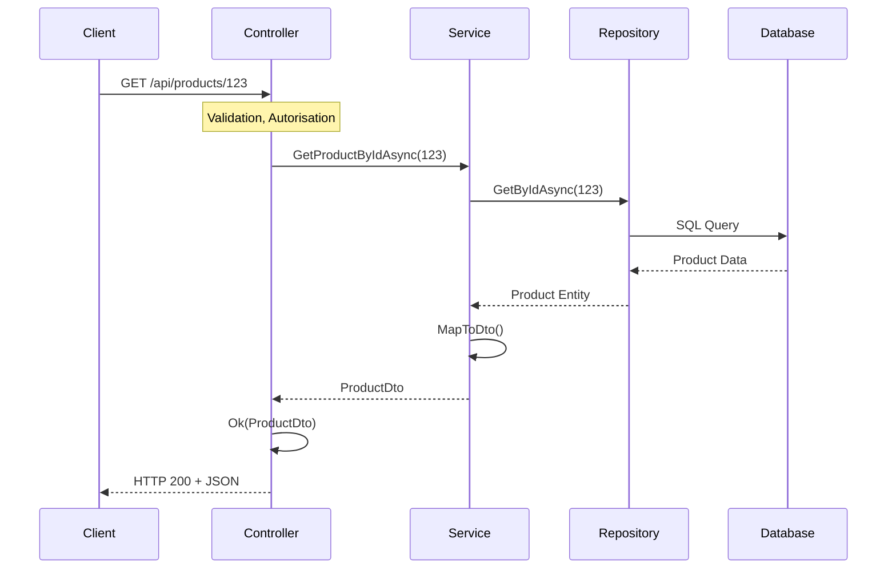
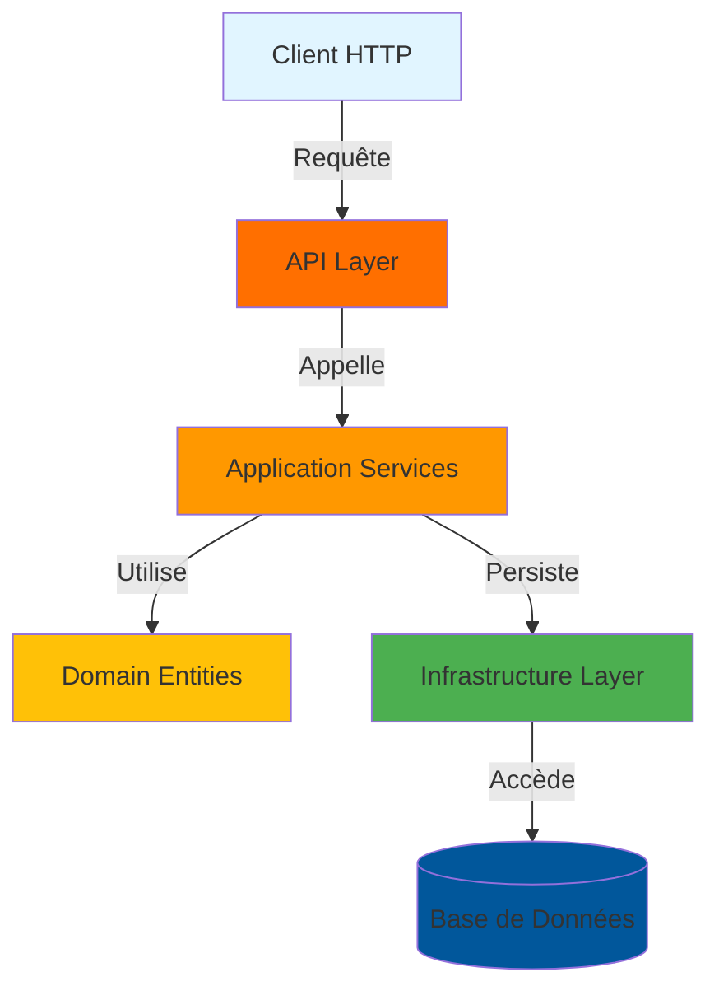

# Architecture - AdvancedDevSample

## 📌 Table des matières
- [Vue d'ensemble](#vue-densemble)
- [Architecture en couches](#architecture-en-couches)
- [Diagrammes architecturaux](#diagrammes-architecturaux)
- [Flux de données](#flux-de-données)
- [Patterns et principes](#patterns-et-principes)
- [Structure détaillée](#structure-détaillée)

---

## Vue d'ensemble

AdvancedDevSample suit une **architecture en couches** (Layered Architecture) qui sépare les responsabilités en 4 couches principales :

```
┌─────────────────────────────────────────────┐
│         API Layer (AdvancedDevSample.Api)   │  ← Contrôleurs, Routes, Validations
├─────────────────────────────────────────────┤
│   Application Layer (AdvancedDevSample.App) │  ← Services, DTOs, Logique métier
├─────────────────────────────────────────────┤
│    Domain Layer (AdvancedDevSample.Domain)  │  ← Entités, Interfaces, Règles métier
├─────────────────────────────────────────────┤
│  Infrastructure (AdvancedDevSample.Infra)   │  ← Base de données, EF Core, Repos
└─────────────────────────────────────────────┘
```

### Principes clés

| Principe | Description |
|----------|------------|
| **Séparation des responsabilités** | Chaque couche a une responsabilité unique et bien définie |
| **Dépendance unidirectionnelle** | Les couches supérieures dépendent des couches inférieures |
| **Indépendance de l'infrastructure** | La logique métier ne connaît pas l'implémentation de la persistance |
| **Testabilité** | Chaque couche peut être testée indépendamment via les interfaces |
| **Maintenabilité** | Les changements d'une couche n'affectent pas les autres |

---

## Architecture en couches

### 🔴 Couche 1 : API (Présentation)

**Fichier parent** : `AdvancedDevSample.Api`

#### Responsabilités
- Exposer les endpoints REST
- Valider les requêtes HTTP
- Gérer l'authentification/autorisation
- Formater les réponses HTTP
- Gérer les exceptions au niveau HTTP

#### Composants principaux

```
AdvancedDevSample.Api/
├── Controllers/
│   ├── AuthController.cs          # Authentification & génération JWT
│   ├── CustomersController.cs     # CRUD Clients
│   ├── OrdersController.cs        # CRUD Commandes
│   ├── ProductsController.cs      # CRUD Produits
│   └── SuppliersController.cs     # CRUD Fournisseurs
├── Filters/
│   ├── GlobalExceptionFilter.cs   # Gestion globale des exceptions
│   ├── LoggingActionFilter.cs     # Logging des actions
│   └── ValidationFilter.cs        # Validation des DTOs
├── Middlewares/
│   ├── ExceptionHandlingMiddleware.cs
│   ├── PerformanceMiddleware.cs   # Mesure des performances
│   └── RequestLoggingMiddleware.cs
├── Properties/
│   └── launchSettings.json        # Configuration de lancement
├── Program.cs                      # Configuration de l'application
├── appsettings.json               # Configuration globale
└── appsettings.Development.json   # Configuration développement
```

#### Exemple de contrôleur

```csharp
[ApiController]
[Route("api/[controller]")]
public class ProductsController : ControllerBase
{
    private readonly IProductService _productService;

    public ProductsController(IProductService productService)
    {
        _productService = productService;
    }

    [HttpGet("{id}")]
    public async Task<IActionResult> GetProduct(Guid id)
    {
        var product = await _productService.GetProductByIdAsync(id);
        return Ok(product);
    }

    [HttpPost]
    [Authorize(Roles = "Admin")]
    public async Task<IActionResult> CreateProduct([FromBody] CreateProductDto dto)
    {
        var product = await _productService.CreateProductAsync(dto);
        return CreatedAtAction(nameof(GetProduct), new { id = product.Id }, product);
    }
}
```

---

### 🟠 Couche 2 : Application

**Fichier parent** : `AdvancedDevSample.Application`

#### Responsabilités
- Implémenter la logique métier
- Orchestrer les interactions entre entités
- Définir les contrats de service (interfaces)
- Transformer les données (DTOs)
- Gérer les transactions

#### Composants principaux

```
AdvancedDevSample.Application/
├── Services/
│   ├── CustomerService.cs        # Logique métier Clients
│   ├── OrderService.cs           # Logique métier Commandes
│   ├── ProductService.cs         # Logique métier Produits
│   ├── SupplierService.cs        # Logique métier Fournisseurs
│   └── AuthService.cs            # Authentification
├── Interfaces/Services/
│   ├── ICustomerService.cs
│   ├── IOrderService.cs
│   ├── IProductService.cs
│   ├── ISupplierService.cs
│   └── IAuthService.cs
├── DTOs/
│   ├── CustomerDto.cs            # DTO Client
│   ├── OrderDto.cs               # DTO Commande
│   ├── ProductDto.cs             # DTO Produit
│   ├── SupplierDto.cs            # DTO Fournisseur
│   └── AuthDto.cs                # DTO Authentification
├── Exceptions/
│   └── ApplicationException.cs    # Exceptions applicatives
└── DependencyInjection.cs         # Configuration des services
```

#### Exemple de service

```csharp
public class ProductService : IProductService
{
    private readonly IUnitOfWork _unitOfWork;

    public ProductService(IUnitOfWork unitOfWork)
    {
        _unitOfWork = unitOfWork;
    }

    public async Task<ProductDto> CreateProductAsync(CreateProductDto dto)
    {
        // Validation métier
        var supplier = await _unitOfWork.SupplierRepository.GetByIdAsync(dto.SupplierId);
        if (supplier == null)
            throw new ApplicationException("Fournisseur non trouvé");

        // Créer l'entité du domaine
        var product = new Product(dto.Name, dto.Price, supplier.Id);

        // Persister
        await _unitOfWork.ProductRepository.AddAsync(product);
        await _unitOfWork.SaveAsync();

        // Retourner le DTO
        return MapToDto(product);
    }

    private ProductDto MapToDto(Product product) => new()
    {
        Id = product.Id,
        Name = product.Name,
        Price = product.Price
    };
}
```

---

### 🟡 Couche 3 : Domain (Domaine métier)

**Fichier parent** : `AdvancedDevSample.Domain`

#### Responsabilités
- Définir les entités métier
- Implémenter les règles métier
- Définir les énumérations
- Publier les événements de domaine
- Lever les exceptions métier

#### Composants principaux

```
AdvancedDevSample.Domain/
├── Entities/
│   ├── Customer.cs               # Entité Client
│   ├── Order.cs                  # Entité Commande
│   ├── OrderItem.cs              # Entité Élément de commande
│   ├── Product.cs                # Entité Produit
│   ├── Supplier.cs               # Entité Fournisseur
│   └── User.cs                   # Entité Utilisateur
├── Enums/
│   └── OrderStatus.cs            # Énumération Statut de commande
├── Events/
│   ├── CustomerEvents.cs         # Événements Client
│   ├── OrderEvents.cs            # Événements Commande
│   ├── ProductEvents.cs          # Événements Produit
│   └── SupplierEvents.cs         # Événements Fournisseur
├── Exceptions/
│   └── DomainExceptions.cs       # Exceptions métier
├── Interfaces/
│   ├── ICustomerRepository.cs    # Interface repos Client
│   ├── IOrderRepository.cs       # Interface repos Commande
│   ├── IProductRepository.cs     # Interface repos Produit
│   ├── ISupplierRepository.cs    # Interface repos Fournisseur
│   ├── IUserRepository.cs        # Interface repos Utilisateur
│   └── IUnitOfWork.cs            # Interface Unit of Work
└── Common/
    └── BaseEntity.cs             # Classe de base des entités
```

#### Exemple d'entité métier

```csharp
public class Order : BaseEntity
{
    private readonly List<OrderItem> _orderItems = new();

    public Order(Guid customerId)
    {
        if (customerId == Guid.Empty)
            throw new DomainException("L'ID du client est requis");

        Id = Guid.NewGuid();
        CustomerId = customerId;
        Status = OrderStatus.Pending;
    }

    public DateTime OrderDate { get; private set; }
    public OrderStatus Status { get; private set; }
    public decimal TotalAmount { get; private set; }
    public Guid CustomerId { get; private set; }
    public IReadOnlyCollection<OrderItem> OrderItems => _orderItems.AsReadOnly();

    public void AddProduct(Product product, int quantity)
    {
        // Règle métier : une commande en attente peut être modifiée
        if (Status != OrderStatus.Pending)
            throw new DomainException("Seules les commandes en attente peuvent être modifiées");

        if (!product.IsActive)
            throw new DomainException("Le produit n'est pas actif");

        var item = new OrderItem(product.Id, quantity, product.Price);
        _orderItems.Add(item);

        CalculateTotal();
        AddDomainEvent(new ProductAddedToOrderEvent(Id, product.Id, quantity));
    }

    private void CalculateTotal()
    {
        TotalAmount = _orderItems.Sum(item => item.Quantity * item.UnitPrice);
    }
}
```

---

### 🟢 Couche 4 : Infrastructure

**Fichier parent** : `AdvancedDevSample.Infrastructure`

#### Responsabilités
- Implémenter la persistance de données
- Implémenter les repositories
- Gérer les migrations Entity Framework
- Implémenter l'Unit of Work
- Configurer la base de données

#### Composants principaux

```
AdvancedDevSample.Infrastructure/
├── DbContext/
│   └── AdvancedDevSampleDbContext.cs  # Configuration EF Core
├── Repositories/
│   ├── EfCustomerRepository.cs        # Repository Client
│   ├── EfOrderRepository.cs           # Repository Commande
│   ├── EfProductRepository.cs         # Repository Produit
│   ├── EfSupplierRepository.cs        # Repository Fournisseur
│   └── EfUserRepository.cs            # Repository Utilisateur
├── Migrations/
│   ├── 20240101000000_InitialCreate.cs
│   ├── 20240102000000_AddCustomers.cs
│   └── ...
├── UnitOfWork.cs                      # Implémentation Unit of Work
├── DependencyInjection.cs             # Configuration des services
└── Exceptions/
    └── InfrastructureException.cs
```

#### Exemple de Repository

```csharp
public class EfProductRepository : IProductRepository
{
    private readonly AdvancedDevSampleDbContext _context;

    public EfProductRepository(AdvancedDevSampleDbContext context)
    {
        _context = context;
    }

    public async Task<Product?> GetByIdAsync(Guid id)
    {
        return await _context.Products.FindAsync(id);
    }

    public async Task<IEnumerable<Product>> GetAllAsync()
    {
        return await _context.Products.Where(p => p.IsActive).ToListAsync();
    }

    public async Task AddAsync(Product product)
    {
        await _context.Products.AddAsync(product);
    }

    public async Task UpdateAsync(Product product)
    {
        _context.Products.Update(product);
        await Task.CompletedTask;
    }

    public async Task DeleteAsync(Guid id)
    {
        var product = await GetByIdAsync(id);
        if (product != null)
        {
            _context.Products.Remove(product);
        }
    }
}
```

---

## Diagrammes architecturaux

### Flux de requête complète



### Dépendances entre couches



### Injection de dépendances

```
Program.cs
├── AddControllers()
├── AddAuthentication(JWT)
├── AddSwagger()
├── services.AddApplication()  ← DependencyInjection.cs (Application)
│   ├── AddScoped<IProductService, ProductService>()
│   ├── AddScoped<ICustomerService, CustomerService>()
│   └── ...
└── services.AddInfrastructure()  ← DependencyInjection.cs (Infrastructure)
    ├── AddDbContext<AdvancedDevSampleDbContext>()
    ├── AddScoped<IUnitOfWork, UnitOfWork>()
    ├── AddScoped<IProductRepository, EfProductRepository>()
    └── ...
```

---

## Flux de données

### Créer un produit

```
1. Client HTTP
   ↓
2. POST /api/products + CreateProductDto
   ↓
3. ProductsController.CreateProduct()
   ├─ Valide le DTO (ValidationFilter)
   ├─ Vérifie l'authentification (JWT)
   ├─ Vérifie l'autorisation (Admin)
   ↓
4. ProductService.CreateProductAsync(dto)
   ├─ Valide les règles métier
   ├─ Récupère le fournisseur
   ├─ Crée l'entité Product (Domain)
   ↓
5. UnitOfWork.ProductRepository.AddAsync(product)
   ├─ Ajoute le produit au DbSet
   ↓
6. UnitOfWork.SaveAsync()
   ├─ Appelle SaveChangesAsync()
   ├─ Exécute les commandes SQL
   ├─ Sauvegarde en base de données
   ↓
7. ProductService retourne ProductDto
   ↓
8. ProductsController retourne CreatedAtAction
   ↓
9. Client reçoit HTTP 201 + ProductDto
```

### Récupérer une commande

```
1. Client HTTP
   ↓
2. GET /api/orders/123
   ↓
3. OrdersController.GetOrder(123)
   ├─ Vérifie l'authentification (JWT)
   ↓
4. OrderService.GetOrderByIdAsync(123)
   ├─ Appelle OrderRepository.GetByIdAsync(123)
   ↓
5. EfOrderRepository.GetByIdAsync(123)
   ├─ Exécute la requête SQL
   ├─ Récupère Order + OrderItems + Product
   ↓
6. Retour de l'entité Order au Service
   ↓
7. Service mappe l'entité à OrderDto
   ├─ Inclut les OrderItemDtos
   ├─ Inclut les ProductDtos
   ↓
8. Retour du OrderDto au Controller
   ↓
9. Controller retourne Http 200 + OrderDto
   ↓
10. Client reçoit la commande au format JSON
```

---

## Patterns et principes

### Patterns utilisés

| Pattern | Lieu | Description |
|---------|------|-------------|
| **Repository** | Infrastructure | Abstrait l'accès aux données |
| **Unit of Work** | Infrastructure | Coordonne les repositories |
| **Dependency Injection** | Partout | Injection des dépendances |
| **DTO** | Application | Transfert de données entre couches |
| **Service Layer** | Application | Encapsule la logique métier |
| **Domain Events** | Domain | Communique les changements métier |
| **Value Objects** | Domain | Objets immuables du domaine |
| **Middleware** | API | Traitement des requêtes |

### SOLID Principles

| Principe | Application | Exemple |
|----------|-----------|---------|
| **S**ingle Responsibility | Chaque classe a UNE responsabilité | ProductService gère les produits |
| **O**pen/Closed | Ouvert à l'extension, fermé à la modification | Interfaces pour extensions |
| **L**iskov Substitution | Les sous-classes peuvent remplacer la classe mère | Tous les repos implémentent l'interface |
| **I**nterface Segregation | Interfaces spécifiques, pas générales | IProductService != IRepository |
| **D**ependency Inversion | Dépendre des abstractions, pas des concrétions | Dépendre d'interfaces, pas de classes |

---

## Structure détaillée

### Entités principales et leurs relations

```
Customer
├── Id (Guid)
├── FirstName (string)
├── LastName (string)
├── Email (string)
├── IsActive (bool)
├── CreatedAt (DateTime)
└── Orders (List<Order>) ←─┐
                            │
Order                        │
├── Id (Guid)                │
├── CustomerId (Guid)  ──────┘
├── OrderDate (DateTime)
├── Status (OrderStatus)
├── TotalAmount (decimal)
├── CreatedAt (DateTime)
└── OrderItems (List<OrderItem>) ←─┐
                                     │
OrderItem                            │
├── Id (Guid)                        │
├── OrderId (Guid) ───────────────┘
├── ProductId (Guid) ────────────┐
├── Quantity (int)                │
├── UnitPrice (decimal)           │
└── CreatedAt (DateTime)          │
                                   │
Product ◄──────────────────────────┘
├── Id (Guid)
├── Name (string)
├── Description (string)
├── Price (decimal)
├── IsActive (bool)
├── SupplierId (Guid)
├── CreatedAt (DateTime)
└── UpdatedAt (DateTime)

Supplier
├── Id (Guid)
├── Name (string)
├── Email (string)
├── IsActive (bool)
├── Products (List<Product>) ←─┐
├── CreatedAt (DateTime)        │
└── UpdatedAt (DateTime)        │

Product → Supplier (via SupplierId)

User
├── Id (Guid)
├── Username (string)
├── Email (string)
├── PasswordHash (string)
├── IsActive (bool)
├── Role (UserRole)
├── CreatedAt (DateTime)
└── UpdatedAt (DateTime)
```

### Énumérations

```csharp
public enum OrderStatus
{
    Pending = 1,      // En attente
    Confirmed = 2,    // Confirmée
    Shipped = 3,      // Expédiée
    Delivered = 4,    // Livrée
    Cancelled = 5     // Annulée
}

public enum UserRole
{
    Admin = 1,        // Administrateur
    Manager = 2,      // Gestionnaire
    User = 3          // Utilisateur
}
```

---

## Configuration de Program.cs

```csharp
var builder = WebApplication.CreateBuilder(args);

// Configuration des services
builder.Services.AddControllers();
builder.Services.AddAuthentication(JwtBearerDefaults.AuthenticationScheme)
    .AddJwtBearer(options => { /* config JWT */ });
builder.Services.AddAuthorization();
builder.Services.AddSwaggerGen();

// Injection de dépendances
builder.Services.AddApplication();      // Services métier
builder.Services.AddInfrastructure();   // DbContext, Repositories

// Configuration de l'app
var app = builder.Build();

app.UseSwagger();
app.UseSwaggerUI();
app.UseHttpsRedirection();
app.UseAuthentication();
app.UseAuthorization();
app.MapControllers();

app.Run();
```

---

## Résumé

AdvancedDevSample suit une architecture bien organisée qui sépare clairement les responsabilités :

✅ **API** : Accepte les requêtes HTTP  
✅ **Application** : Orchestre la logique métier  
✅ **Domain** : Encapsule les règles métier  
✅ **Infrastructure** : Gère la persistance  

Cette séparation rend le code :
- **Testable** : Chaque couche peut être testée seule
- **Maintenable** : Les changements sont localisés
- **Extensible** : Nouvelles fonctionnalités facilement
- **Réutilisable** : Les services peuvent être utilisés partout

Pour plus de détails, consultez les guides spécialisés.
