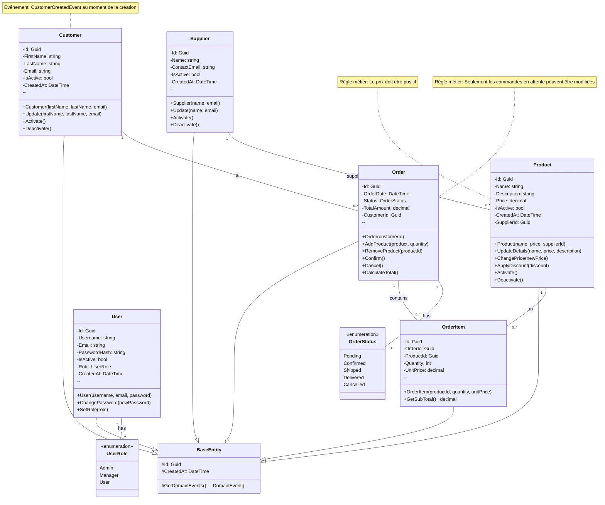
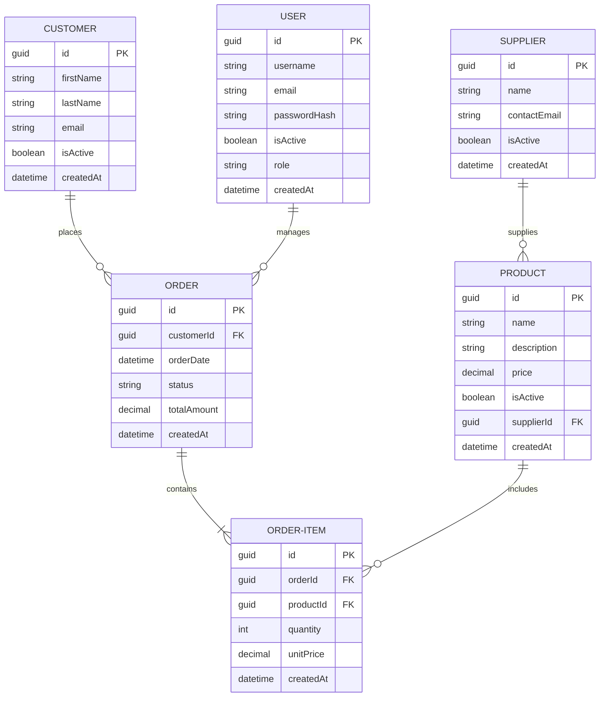

# Modèles du Domaine - AdvancedDevSample

## 📌 Table des matières
- [Introduction](#introduction)
- [Entités principales](#entités-principales)
- [Énumérations](#énumérations)
- [Événements de domaine](#événements-de-domaine)
- [Exceptions de domaine](#exceptions-de-domaine)
- [Interfaces des repositories](#interfaces-des-repositories)
- [Diagrammes UML](#diagrammes-uml)

---

## Introduction

Le domaine métier encapsule toutes les règles métier et les contraintes de l'application. Les entités du domaine sont responsables de maintenir leur propre cohérence et d'appliquer les règles métier.

**Principes clés** :
- Les entités sont immuables en externe (propriétés privées)
- Les changements se font par des méthodes publiques
- Les règles métier sont validées dans le domaine, pas dans la couche API
- Les entités publient des événements de domaine lors de changements importants

---

## Entités principales

### Customer (Client)

#### Responsabilités
- Représenter un client commercial
- Valider les données du client (email, nom)
- Gérer l'état actif/inactif du client
- Publier des événements de création/modification

#### Propriétés

```csharp
public class Customer : BaseEntity
{
    public Guid Id { get; private set; }
    public string FirstName { get; private set; }
    public string LastName { get; private set; }
    public string Email { get; private set; }
    public bool IsActive { get; private set; }
    public DateTime CreatedAt { get; private set; }
    public IReadOnlyCollection<Order> Orders { get; private set; }
}
```

#### Méthodes

| Méthode | Paramètres | Règles métier |
|---------|-----------|---------------|
| `Constructor` | FirstName, LastName, Email | Email valide, non vide |
| `Activate()` | - | Rend le client actif |
| `Deactivate()` | - | Rend le client inactif |
| `Update()` | FirstName, LastName, Email | Valide les paramètres |

#### Événements publiés

```csharp
// À la création
new CustomerCreatedEvent(customer)

// À l'activation
new CustomerActivatedEvent(customerId)

// À la désactivation
new CustomerDeactivatedEvent(customerId)

// À la mise à jour
new CustomerUpdatedEvent(customerId)
```

#### Exemple d'utilisation

```csharp
// Créer un client
var customer = new Customer(
    firstName: "Jean",
    lastName: "Dupont",
    email: "jean.dupont@example.com"
);

// Modifier le client
customer.Update(
    firstName: "Jean-Paul",
    lastName: "Dupont",
    email: "jean-paul.dupont@example.com"
);

// Désactiver le client
customer.Deactivate();

// Les événements sont automatiquement collectés
var events = customer.GetDomainEvents();
```

---

### Product (Produit)

#### Responsabilités
- Représenter un produit vendable
- Valider le prix et les données du produit
- Gérer l'état actif/inactif
- Maintenir la relation avec le fournisseur

#### Propriétés

```csharp
public class Product : BaseEntity
{
    public Guid Id { get; private set; }
    public string Name { get; private set; }
    public string Description { get; private set; }
    public decimal Price { get; private set; }
    public bool IsActive { get; private set; }
    public Guid SupplierId { get; private set; }
    public DateTime CreatedAt { get; private set; }
    public DateTime UpdatedAt { get; private set; }
}
```

#### Règles métier

- Le prix doit être positif
- Le nom est obligatoire
- Un produit inactif ne peut pas être commandé
- Chaque produit doit avoir un fournisseur
- La description est optionnelle

#### Méthodes

| Méthode | Description |
|---------|------------|
| `constructor(name, price, supplierId)` | Crée un produit actif par défaut |
| `UpdateDetails(name, price, description)` | Met à jour les informations |
| `Activate()` | Active le produit |
| `Deactivate()` | Désactive le produit |
| `UpdatePrice(newPrice)` | Change le prix avec validation |

#### Exemple

```csharp
var product = new Product(
    name: "Laptop Pro",
    price: 1999.99M,
    supplierId: supplierGuid
);

// Changer le prix
product.UpdatePrice(2199.99M);

// Désactiver
product.Deactivate();
```

---

### Order (Commande)

#### Responsabilités
- Représenter une commande client
- Gérer les articles de la commande
- Valider les transitions de statut
- Calculer le total
- Publier les événements de commande

#### Propriétés

```csharp
public class Order : BaseEntity
{
    public Guid Id { get; private set; }
    public Guid CustomerId { get; private set; }
    public DateTime OrderDate { get; private set; }
    public OrderStatus Status { get; private set; }
    public decimal TotalAmount { get; private set; }
    public DateTime CreatedAt { get; private set; }
    public IReadOnlyCollection<OrderItem> OrderItems { get; private set; }
}
```

#### Statuts de commande

```
┌─────────┐
│ Pending │ (Initial)
└────┬────┘
     │ AddProduct()
     │ RemoveProduct()
     │
     ↓
┌──────────┐
│Confirmed │
└────┬─────┘
     │ Ship()
     ↓
┌────────┐
│ Shipped│
└────┬───┘
     │ Deliver()
     ↓
┌──────────┐
│Delivered │ (Final)
└──────────┘

À tout moment : Cancel() → Cancelled (Final)
```

#### Règles métier

1. **Création** : Une commande est créée avec le statut `Pending`
2. **Modification** : Seules les commandes `Pending` peuvent être modifiées
3. **Confirmation** : La commande doit avoir au moins 1 article
4. **Expédition** : La commande doit être confirmée
5. **Annulation** : Possible à tout moment sauf si livrée

#### Méthodes principales

```csharp
// Ajouter un produit (Pending uniquement)
public void AddProduct(Product product, int quantity)
{
    // Validations...
    _orderItems.Add(new OrderItem(...));
    CalculateTotal();
}

// Confirmer la commande
public void Confirm()
{
    if (Status != OrderStatus.Pending)
        throw new DomainException("Seules les commandes en attente peuvent être confirmées");
    
    if (!_orderItems.Any())
        throw new DomainException("La commande doit avoir au moins 1 produit");
    
    Status = OrderStatus.Confirmed;
}

// Expédier
public void Ship()
{
    if (Status != OrderStatus.Confirmed)
        throw new DomainException("Seules les commandes confirmées peuvent être expédiées");
    
    Status = OrderStatus.Shipped;
}
```

#### Exemple complet

```csharp
// Créer la commande
var order = new Order(customerId);

// Ajouter des produits
order.AddProduct(laptop, quantity: 1);
order.AddProduct(monitor, quantity: 2);

// Total calculé automatiquement : 2499.98

// Confirmer
order.Confirm();
// Status = Confirmed, événement publié

// Expédier
order.Ship();
// Status = Shipped
```

---

### OrderItem (Élément de commande)

#### Responsabilités
- Représenter un produit dans une commande
- Stocker la quantité et le prix unitaire
- Calculer le sous-total

#### Propriétés

```csharp
public class OrderItem : BaseEntity
{
    public Guid Id { get; private set; }
    public Guid OrderId { get; private set; }
    public Guid ProductId { get; private set; }
    public int Quantity { get; private set; }
    public decimal UnitPrice { get; private set; }
    public decimal Subtotal => Quantity * UnitPrice;
    public DateTime CreatedAt { get; private set; }
}
```

#### Règles métier

- Quantité >= 1
- Prix unitaire copié du produit au moment de l'ajout
- Le prix est figé (snapshot)

---

### Supplier (Fournisseur)

#### Responsabilités
- Représenter un fournisseur de produits
- Valider les données du fournisseur
- Gérer la relation avec les produits

#### Propriétés

```csharp
public class Supplier : BaseEntity
{
    public Guid Id { get; private set; }
    public string Name { get; private set; }
    public string Email { get; private set; }
    public bool IsActive { get; private set; }
    public DateTime CreatedAt { get; private set; }
    public DateTime UpdatedAt { get; private set; }
    public IReadOnlyCollection<Product> Products { get; private set; }
}
```

#### Méthodes

```csharp
public Supplier(string name, string email)
{
    // Validations...
}

public void Update(string name, string email)
{
    // Validations...
}

public void Activate() { }
public void Deactivate() { }
```

---

### User (Utilisateur)

#### Responsabilités
- Représenter un utilisateur du système
- Gérer l'authentification
- Stocker les rôles et permissions

#### Propriétés

```csharp
public class User : BaseEntity
{
    public Guid Id { get; private set; }
    public string Username { get; private set; }
    public string Email { get; private set; }
    public string PasswordHash { get; private set; }
    public bool IsActive { get; private set; }
    public UserRole Role { get; private set; }
    public DateTime CreatedAt { get; private set; }
    public DateTime LastLoginAt { get; private set; }
}
```

#### Rôles (UserRole)

```csharp
public enum UserRole
{
    Admin = 1,      // Accès complet
    Manager = 2,    // Gestion des commandes et clients
    User = 3        // Accès limité (consultation)
}
```

---

## Énumérations

### OrderStatus

```csharp
public enum OrderStatus
{
    Pending = 1,      // En attente (commande vide)
    Confirmed = 2,    // Confirmée (prête à être expédiée)
    Shipped = 3,      // Expédiée
    Delivered = 4,    // Livrée
    Cancelled = 5     // Annulée
}
```

### UserRole

```csharp
public enum UserRole
{
    Admin = 1,        // Administrateur
    Manager = 2,      // Gestionnaire
    User = 3          // Utilisateur standard
}
```

---

## Événements de domaine

Les événements de domaine communiquent les changements importants au reste de l'application.

### Structure d'un événement

```csharp
public class DomainEvent
{
    public Guid AggregateId { get; set; }
    public DateTime OccurredAt { get; set; } = DateTime.UtcNow;
    public string EventType { get; set; }
}
```

### Événements Customer

```csharp
// Quand : création d'un client
public class CustomerCreatedEvent : DomainEvent
{
    public string FirstName { get; set; }
    public string LastName { get; set; }
    public string Email { get; set; }
}

// Quand : activation d'un client
public class CustomerActivatedEvent : DomainEvent
{
    public Guid CustomerId { get; set; }
}

// Quand : désactivation
public class CustomerDeactivatedEvent : DomainEvent
{
    public Guid CustomerId { get; set; }
}

// Quand : mise à jour
public class CustomerUpdatedEvent : DomainEvent
{
    public Guid CustomerId { get; set; }
}
```

### Événements Order

```csharp
// Quand : création de commande
public class OrderCreatedEvent : DomainEvent
{
    public Guid OrderId { get; set; }
    public Guid CustomerId { get; set; }
}

// Quand : ajout de produit
public class ProductAddedToOrderEvent : DomainEvent
{
    public Guid OrderId { get; set; }
    public Guid ProductId { get; set; }
    public int Quantity { get; set; }
}

// Quand : confirmation de commande
public class OrderConfirmedEvent : DomainEvent
{
    public Guid OrderId { get; set; }
    public decimal TotalAmount { get; set; }
}
```

### Événements Product

```csharp
public class ProductCreatedEvent : DomainEvent { }
public class ProductUpdatedEvent : DomainEvent { }
public class ProductActivatedEvent : DomainEvent { }
public class ProductDeactivatedEvent : DomainEvent { }
```

### Événements Supplier

```csharp
public class SupplierCreatedEvent : DomainEvent { }
public class SupplierUpdatedEvent : DomainEvent { }
public class SupplierActivatedEvent : DomainEvent { }
public class SupplierDeactivatedEvent : DomainEvent { }
```

---

## Exceptions de domaine

### DomainException

Exception levée quand une règle métier est violée.

```csharp
public class DomainException : Exception
{
    public string Code { get; set; }
    public Dictionary<string, object> Details { get; set; }

    public DomainException(string message, string code = "DOMAIN_ERROR")
        : base(message)
    {
        Code = code;
        Details = new Dictionary<string, object>();
    }
}
```

### Cas d'utilisation

```csharp
// Quand la commande est déjà confirmée
throw new DomainException(
    "Seules les commandes en attente peuvent être modifiées",
    "INVALID_ORDER_STATUS"
);

// Quand le produit n'existe pas
throw new DomainException(
    "Le produit n'est pas actif",
    "PRODUCT_INACTIVE"
);

// Quand l'email est invalide
throw new DomainException(
    "L'email n'est pas valide",
    "INVALID_EMAIL"
);
```

---

## Interfaces des repositories

### IRepository<T> (Interface générique)

```csharp
public interface IRepository<T> where T : BaseEntity
{
    Task<T?> GetByIdAsync(Guid id);
    Task<IEnumerable<T>> GetAllAsync();
    Task AddAsync(T entity);
    Task UpdateAsync(T entity);
    Task DeleteAsync(Guid id);
}
```

### ICustomerRepository

```csharp
public interface ICustomerRepository : IRepository<Customer>
{
    Task<Customer?> GetByEmailAsync(string email);
    Task<IEnumerable<Customer>> GetActiveAsync();
    Task<bool> EmailExistsAsync(string email, Guid? excludeCustomerId = null);
}
```

### IProductRepository

```csharp
public interface IProductRepository : IRepository<Product>
{
    Task<IEnumerable<Product>> GetBySupplierAsync(Guid supplierId);
    Task<IEnumerable<Product>> GetActiveAsync();
    Task<IEnumerable<Product>> SearchAsync(string searchTerm, decimal? minPrice, decimal? maxPrice);
}
```

### IOrderRepository

```csharp
public interface IOrderRepository : IRepository<Order>
{
    Task<IEnumerable<Order>> GetByCustomerAsync(Guid customerId);
    Task<IEnumerable<Order>> GetByStatusAsync(OrderStatus status);
    Task<IEnumerable<Order>> GetByDateRangeAsync(DateTime from, DateTime to);
}
```

### ISupplierRepository

```csharp
public interface ISupplierRepository : IRepository<Supplier>
{
    Task<Supplier?> GetByEmailAsync(string email);
    Task<IEnumerable<Supplier>> GetActiveAsync();
    Task<bool> EmailExistsAsync(string email, Guid? excludeId = null);
}
```

### IUnitOfWork

```csharp
public interface IUnitOfWork : IDisposable
{
    ICustomerRepository CustomerRepository { get; }
    IProductRepository ProductRepository { get; }
    IOrderRepository OrderRepository { get; }
    ISupplierRepository SupplierRepository { get; }
    IUserRepository UserRepository { get; }

    Task<int> SaveAsync();
    Task<int> SaveChangesAsync();
    Task BeginTransactionAsync();
    Task CommitAsync();
    Task RollbackAsync();
}
```

---

## Diagrammes UML

### Diagramme de classes (Class Diagram)



### Diagramme des relations (Entity-Relationship)



---

## Résumé

Les modèles de domaine encapsulent :

✅ **Les entités** : Customer, Product, Order, OrderItem, Supplier, User  
✅ **Les règles métier** : Validations, transitions de statut, contraintes  
✅ **Les énumérations** : OrderStatus, UserRole  
✅ **Les événements** : Notifications des changements  
✅ **Les exceptions** : Erreurs métier  
✅ **Les interfaces** : Contrats de persistance  

Cette approche assure que la logique métier est indépendante de l'infrastructure et facile à tester.
