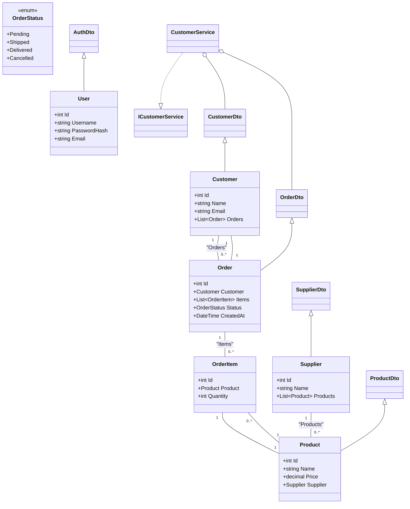

# Documentation technique AdvancedDevSample

## Description technique

AdvancedDevSample est une application .NET multi-couche organisée selon la séparation des responsabilités :  
- **Domain** : entités métier, interfaces, énumérations, événements  
- **Application** : services métier (business logic), DTOs, exceptions  
- **Infrastructure** : persistance (Entity Framework, repositories, migrations)  
- **Api** : contrôleurs, middlewares, filtres, composition de l’application

---

## 1. Diagramme d’architecture logicielle (vue container)

```mermaid
flowchart TD
  subgraph Utilisateurs [Utilisateurs]
    ClientWeb([Client Web / Outil API])
  end

  subgraph API [AdvancedDevSample.Api]
    APIControllers[Controllers (Customers, Orders, Auth, etc.)]
    Middlewares
    Filters
  end

  subgraph Application [AdvancedDevSample.Application]
    Services[Services métier (CustomerService, ProductService, etc.)]
    DTOs[DTOs & Exceptions]
  end

  subgraph Domain [AdvancedDevSample.Domain]
    Entities[Entités, Interfaces, Enums, Events]
  end

  subgraph Infrastructure [AdvancedDevSample.Infrastructure]
    Repositories[Repositories EF]
    DbContext[(DbContext)]
  end

  DB[(Base de Données)]

  ClientWeb --> APIControllers
  APIControllers --appelle--> Middlewares
  APIControllers --appelle services--> Services
  Services --utilise modèles--> DTOs
  Services --référence--> Entities
  Services --persistance--> Repositories
  Repositories --repos implémentent interfaces--> Entities
  Repositories --repos utilisent--> DbContext
  DbContext --ORM--> DB
```

---

## 2. Diagramme de classes (domain + application principaux)



---

## 3. Diagramme de composants (contrôleurs, services et repository)

```mermaid
componentDiagram
  package "AdvancedDevSample.Api" {
      [AuthController] --> [AuthService]
      [CustomersController] --> [CustomerService]
      [ProductsController] --> [ProductService]
      [SuppliersController] --> [SupplierService]
      [OrdersController] --> [OrderService]
  }

  package "AdvancedDevSample.Application" {
      [AuthService] --> [IAuthService]
      [CustomerService] --> [ICustomerService]
      [ProductService] --> [IProductService]
      [SupplierService] --> [ISupplierService]
      [OrderService] --> [IOrderService]
  }

  package "AdvancedDevSample.Infrastructure" {
      [IAuthService] --> [EfUserRepository]
      [ICustomerService] --> [EfCustomerRepository]
      [IProductService] --> [EfProductRepository]
      [ISupplierService] --> [EfSupplierRepository]
      [IOrderService] --> [EfOrderRepository]
      [All Repositories] --> [AdvancedDevSampleDbContext]
      [AdvancedDevSampleDbContext] --> [Database]
  }
```

---

## 4. Explications complémentaires

- **API Layer** : Expose les endpoints, gère routing, validation, log et exceptions.
- **Application Layer** : Implémente toute la logique métier, transformations, validations serveur.
- **Domain Layer** : Regroupe les entités métiers, règles métier fondamentales, interfaces des repository.
- **Infrastructure Layer** : Fait le lien entre modèles métiers et stockage SQL, réalise mappings et transactions via EF Core.

- **Découplage assuré** par usages d’interfaces, DTOs, inversion de dépendances et pattern Repository/Unit of Work.

---

## 5. Pour modifier ou faire évoluer l’architecture

- Ajoute ou ajuste une entité dans Domain, le DTO et le Service associé dans Application et expose dans l’API.
- Crée le repository implémenté dans Infrastructure et relie-le via l’interface du Domain dans l’Application.
- Adapte ou crée une migration dans Migrations/ de l’Infrastructure pour la persistance.

---

Pour générer ou visualiser les diagrammes, copie-colle le code Mermaid dans [Mermaid Live Editor](https://mermaid.live).
